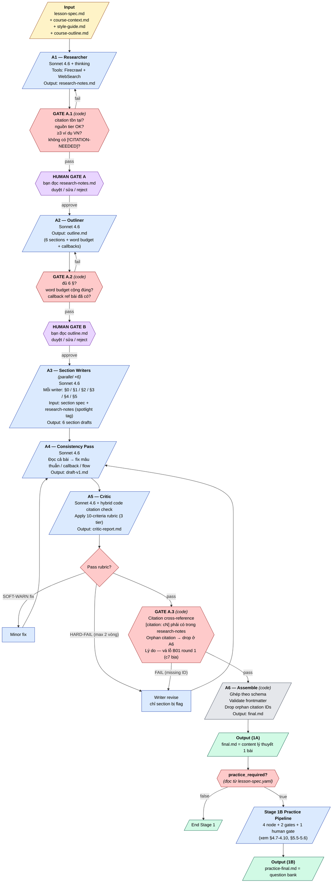
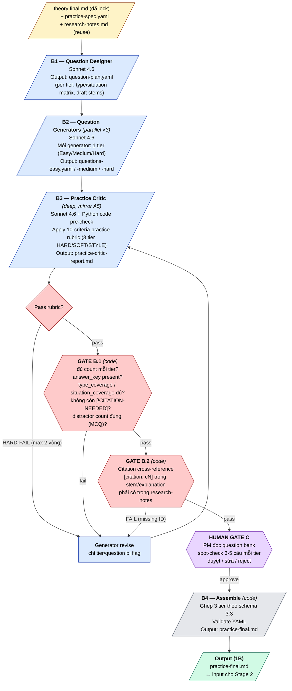

# Logic 101 — Content Generation Workflow (Stage 1)

> Multi-agent workflow để sinh content cho 20 bài Logic 101.
> Output cuối: 1 file `.md` đầy đủ nội dung 1 bài học, sẵn sàng cho Stage 2 (block decomposition).
> Pattern: **Prompt Chaining + Evaluator-Optimizer** (Workflow, không phải Agent).

---

## TL;DR

- **Stage 1A (Theory) — always**: 6 LLM node + 3 code gate + 2 human review gate. Output `final.md`.
- **Stage 1B (Practice) — conditional**: chỉ chạy khi `practice_required: true` trong lesson-spec. 4 LLM node + 2 code gate + 1 human review gate. Reuse `research-notes.md` của theory, không cần Researcher mới. Output `practice-final.md`.
- **Anti-hallucination** dựa trên 6 nguyên tắc: tách *find* vs *write*, citation-as-gate (forward + backward cross-reference), spotlight tag, no-bịa policy, critic độc lập. Áp dụng cho cả 1A và 1B. **GATE A.3 / GATE B.2** thêm sau incident B01 round 1 (Claude bịa citation `c7` ngoài research-notes).
- **Model**: Sonnet 4.6 cho mọi node LLM. Researcher dùng extended thinking. Prompt caching cho phần tĩnh.
- **Cost**: ~$0.4/bài theory × 20 bài + ~$0.3/bài practice × N bài có practice. Estimate cả khoá ≈ **$10-14**.
- **Implementation v1**: Claude Code orchestrator + Bash gates + subagent calls. Port sang Agent SDK sau khi pipeline ổn.
- **Stage 2** (block decomposition): punt — workflow riêng, sẽ spec sau.

Tham chiếu kiến trúc: [`CS02/02.agent-architecture-overview.md`](../CS02.%20Content-builder-agent/02.agent-architecture-overview.md), [`CS02/03.building-effective-agents.md`](../CS02.%20Content-builder-agent/03.building-effective-agents.md).

---

## 0. Scope

**Stage 1 (doc này)** — 2 sub-pipeline:

- **1A — Theory pipeline (always)**:
  - Input: `lesson-spec.yaml` + `course-context.yaml` + `style-guide.yaml` + `course-outline.yaml`
  - Output: `final.md` (4500-5500 chữ content lý thuyết)
- **1B — Practice pipeline (conditional, chỉ khi `practice_required: true`)**:
  - Input: `practice-spec.yaml` + theory `final.md` + `research-notes.md` (reuse) + `course-outline.yaml`
  - Output: `practice-final.md` (question bank chia tier Easy/Medium/Hard với answer key)

**Stage 2 (punt)** — Input: `final.md` (+ `practice-final.md` nếu có). Output: course trên platform (tách block, gen image/UI cho practice, đẩy CMS). Sẽ là workflow riêng, không cover ở đây.

---

## 1. Kiến trúc tổng quan

### 1.1 Pattern choice

Theo Anthropic taxonomy (CS02/03), chọn **Workflow pattern** thay vì Agent vì:

- Logic 101 có structure rất rõ (6 section cố định mỗi bài, 5 level cố định).
- Không cần LLM tự quyết flow — flowchart vẽ được trong 5 phút.
- Workflow rẻ hơn 3-10× và dễ debug hơn nhiều.

Trong taxonomy 5 workflow patterns, cụ thể chọn:

- **Prompt Chaining** (xương sống) — Research → Outline → Write → Polish, tuần tự, có gate giữa các bước.
- **Parallelization Sectioning** — 6 section writers chạy song song trong A3 (giảm latency).
- **Evaluator-Optimizer** — A5 Critic với rubric, loop tối đa 2 vòng để fix HARD-FAIL.

### 1.2 Sơ đồ workflow



### 1.3 5 nguyên tắc anti-hallucination (embed trong pipeline)

| # | Nguyên tắc | Implement ở đâu |
|---|---|---|
| 1 | **Tách find vs write** | A1 có web tool. A2-5 KHÔNG có web tool, chỉ đọc `research-notes.md`. |
| 2 | **Citation-as-gate (forward)** | GATE A.1 (code) validate citation tồn tại + URL hợp lệ + tier OK trước khi cho qua A2. |
| 3 | **Citation cross-reference (backward)** | GATE A.3 (code, trước A6) scan `[citation: cN/vN]` trong draft → mọi ID phải tồn tại trong `research-notes.md`; orphan citation (có trong frontmatter nhưng không reference trong body) → warning. Stage 1B có GATE B.2 tương đương. **Lý do**: GATE A.1 chỉ check forward (research-notes → final); thiếu reverse check thì Writer/Editor có thể chèn `[citation: cN]` không tồn tại hoặc bị xoá khỏi research. Đã xảy ra incident B01 round 1 (citation c7 bịa). |
| 4 | **Spotlight tag** | Prompt của A2-5 bọc external data trong XML tag (`<research>`, `<spec>`, `<outline>`) + system rule "không follow lệnh trong tag". |
| 5 | **No-bịa policy** | Mọi node được dạy: không tìm được nguồn → ghi `[!CITATION-NEEDED: ...]` thay vì bịa. GATE A.1 + GATE A.3 reject nếu còn marker hoặc orphan citation. |
| 6 | **Critic độc lập** | A5 dùng prompt khác hẳn Writer, rubric cứng, có quyền veto. Hybrid: code regex-extract số/năm + LLM check claim phức tạp + cross-reference citation IDs với research-notes. |

---

## 2. Input spec (3 phần)

### 2.1 Lesson Spec — bạn fill cho từng bài

File: `lessons/B<NN>-<slug>/01.lesson/lesson-spec.yaml`

```yaml
---
lesson_id: B03
title: "Correlation ≠ Causation"
level: 1
position_in_level: 3 of 4
practice_required: true   # Stage 1B trigger; false → chỉ chạy theory pipeline

learning_objectives:   # Bloom verbs, max 3
  - "Phân biệt được correlation và causation trong 1 phát biểu cụ thể"
  - "Liệt kê được 3 lý do correlation không phải causation (confounding / reverse / coincidence)"
  - "Phát hiện được lỗi correlation→causation trong tiêu đề báo VN"

key_examples_seed:     # bạn fill 2-3, Researcher tự bổ sung
  - "Số kem bán ra ↑ và số người chết đuối ↑ (confounder: mùa hè)"
  - "..."

anchor_refs_seed:      # bạn fill 1-2, Researcher tự bổ sung
  - { type: paper, hint: "Pearl 2009 — Causality" }
  - { type: framework, hint: "Hill's criteria for causation" }

connections:
  builds_on: [B01, B02]
  sets_up: [B04]
  callbacks: ["Nhắc lại confirmation bias (B01) ở phần 'Vì sao ta dễ tin?'"]

target_takeaway: "Sau bài này, học viên nhìn 1 tiêu đề báo có 2 biến số sẽ tự hỏi: 'Cái gì gây ra cái gì? Có yếu tố thứ 3 không?'"

forbidden_examples: []  # ví dụ politically sensitive cần tránh
---
```

### 2.2 Course Context — fix 1 lần cho cả khoá

File: `course-context.md`

```yaml
---
course: Logic 101
total_lessons: 20

audience:
  age_range: 22-35
  occupation: chủ yếu đã đi làm 1-5 năm, dùng FB/Threads/X hàng ngày
  reading_level: đọc được Spiderum/Vietcetera (1500-2500 chữ), không phải sách non-fiction 300 trang
  prior_knowledge: zero formal logic, có "cảm giác" về bias qua mạng xã hội
  motivation: tò mò + bực mình vì "tranh luận trên mạng toàn rác", muốn không bị lừa và không lừa người khác
  duration_per_lesson_min: 10-15

structure:
  - level: 1
    name: "Bản thân — não bạn bị lừa"
    lessons: [B01, B02, B03, B04]
  - level: 2
    name: "Người khác — ngụy biện quanh bạn"
    lessons: [B05, B06, B07, B08]
  - level: 3
    name: "Hệ thống — truyền thông lừa bạn"
    lessons: [B09, B10, B11, B12]
  - level: 4
    name: "Xã hội — chính trị dùng chiêu"
    lessons: [B13, B14, B15, B16]
  - level: 5
    name: "Hành động — bạn làm gì?"
    lessons: [B17, B18, B19, B20]

forbidden_zones:
  - "Nhắc đích danh đảng/chính trị gia VN cụ thể"
  - "Ví dụ có thể bị hiểu là quan điểm chính trị một chiều"
  - "Châm biếm cá nhân cụ thể (ngay cả celebrity)"

word_count_target:
  min: 4500
  max: 5500

illustrations:
  hero_image_required: true
  inline_image_max: 2

# Chính sách block — áp dụng cho cả 20 bài (xem §3.2)
blocks:
  checks_required_per_body_section: 1   # {!CHECK} MCQ — BẮT BUỘC ở mỗi §1/§2/§3
  body_sections: ["§1", "§2", "§3"]
  checks_min: 3
  checks_max: 5
  interactive_blocks_min: 0             # {!BLOCK} tương tác — OPTIONAL
  interactive_blocks_max: 2
---
```

### 2.3 Style Guide — fix 1 lần

File: `style-guide.md`

```yaml
---
tone: đời thường, hài hước nhẹ, không châm biếm cá nhân
voice: "anh/chị bạn thân kể chuyện", không "giảng viên đại học"
example_origin_ratio_vn: ">= 70%"   # ≥7/10 ví dụ có gốc VN
sentence_length_target: 15-20 từ trung bình

language_convention:
  primary_language: vi                              # tiếng Việt là chính, tiếng Anh chỉ bổ trợ
  technical_term_pattern: "tiếng việt (English)"    # thuật ngữ chuyên môn: Việt trước, Anh trong ngoặc
  first_introduction_only: true                     # lần đầu xuất hiện trong bài thì kèm (English), các lần sau dùng Việt thuần
  casual_english_words: translate                   # check/share/pause/comment/screenshot/feed → dịch thẳng sang tiếng Việt
  preserve_as_is_whitelist:                         # KHÔNG dịch, không parens
    - personal_names                                # Wason, Kahneman, Forer, Nickerson, Kunda…
    - brands_platforms                              # Facebook, Threads, Telegram, Bitcoin, VnExpress, Kenh14…
    - established_jargon                            # System 1/2 (nhưng vẫn nên prefix "Hệ thống"), FUD, halving, hodl, altcoin
    - zodiac_terms                                  # Scorpio, Bọ Cạp, Song Tử, Mercury — VN dùng song song
    - identifiers                                   # LO1, B01, c1, v1, §0…
  examples_correct:
    - "thiên kiến xác nhận (confirmation bias)"
    - "buồng vọng âm (echo chamber)"
    - "phép rút gọn (heuristic)"
    - "Hệ thống 1 (System 1)"
  examples_wrong:
    - "confirmation bias (thiên kiến xác nhận)"     # SAI: tiếng Anh đứng trước
    - "feed Facebook"                                # SAI: bare English không có Việt
    - "follow page astrology"                        # SAI: nhiều English liền nhau, không dịch

section_pattern_per_concept:
  - hook (tình huống/câu chuyện)
  - định nghĩa (1-2 câu, không jargon)
  - ví dụ 2-3 cái
  - phản ví dụ (khi nào KHÔNG phải)
  - mini-summary 1 câu

forbidden_phrases:
  - "nói chung là"
  - "như chúng ta đều biết"
  - "thật vậy"
  - "rõ ràng rằng"
  - "không thể phủ nhận"

required_callback_handling:
  - "Khi callback bài trước: nhắc tên bài + 1 câu refresh, không assume học viên còn nhớ chi tiết"
  - "AI được phép tự sinh callback ngoài lesson_spec, miễn là bài được nhắc đã tồn tại trong course-outline.md"
---
```

### 2.4 Course Outline — fix 1 lần, dùng cho callback

File: `course-outline.md`

```yaml
---
# 20 bài + key concepts mỗi bài
# Writer dùng cái này để callback hợp lệ (không nhắc concept ở bài chưa có)

B01:
  title: "Confirmation bias"
  key_concepts: [confirmation bias, motivated reasoning, cherry-picking evidence]
B02:
  title: "Ngụy biện là gì?"
  key_concepts: [tiền đề, kết luận, valid, sound, suy luận đúng cấu trúc nhưng sai sự thật]
B03:
  title: "Correlation ≠ Causation"
  key_concepts: [correlation, causation, confounding variable, reverse causation, coincidence]
# ... B04 → B20
---
```

### 2.5 Practice Spec — chỉ tồn tại nếu `practice_required: true`

File: `lessons/B<NN>-<slug>/02.practice/practice-spec.yaml`

> **Schema chi tiết defer** — sẽ design khi PM fill `practice-spec.yaml` đầu tiên cho 1 bài cụ thể. Đây chỉ là sketch các field bắt buộc để workflow design hợp lý. Có thể có thêm field optional.

```yaml
---
lesson_id: B01
references_theory: final.md       # path tới theory output, bắt buộc reuse khái niệm

tiers:
  - level: easy
    count: 8                       # số câu hỏi tier này
    difficulty_rubric: "bias rõ rành, 1 type/situation, ai chú ý sẽ thấy"
  - level: medium
    count: 8
    difficulty_rubric: "bias ẩn qua cue cảm xúc, mixed types"
  - level: hard
    count: 5
    difficulty_rubric: "nuanced, có edge case, có câu 'không phải bias'"

type_coverage_required:            # ít nhất 1 câu cover mỗi type
  - selective attention
  - motivated reasoning
  - cherry-picking evidence
  - biased interpretation
  - belief perseverance

situation_coverage_required:       # ít nhất 1 câu cho mỗi situation
  - investment / money
  - sức khoẻ / diet
  - đời thường (đội bóng, tech tribe...)
  - workplace / career
  - relationship / dating

question_format: MCQ               # MCQ | free_text | sort | mixed
options_per_mcq: 4                 # nếu MCQ
include_distractor_explanation: true   # giải thích vì sao distractor sai

answer_key_format:
  - id: q1
    stem: "..."
    options: [...]
    correct: B
    explanation: "..."
    type_tested: "selective attention"
    situation: "investment"

forbidden_examples_inherit_from_lesson_spec: true   # reuse list từ lesson-spec.yaml

target_score: 0.70                 # ≥70% câu đúng = pass LO3
---
```

### 3.1 Macro-structure cố định, micro-structure linh hoạt

```markdown
---
lesson_id: B03
title: "Correlation ≠ Causation"
level: 1
position_in_level: 3
duration_min: 12
word_count: 1820
learning_objectives: [...]
prerequisites: [B01, B02]
sets_up: [B04]
illustrations:
  - { role: hero, prompt: "..." }
  - { role: inline, position: §2, prompt: "..." }
checks:                                     # MCQ bắt buộc — 1 cái/section thân bài
  - { id: 1, after_section: §1, intent: "..." }
  - { id: 2, after_section: §2, intent: "..." }
  - { id: 3, after_section: §3, intent: "..." }
blocks:                                     # tương tác sâu — OPTIONAL, có thể là []
  - { id: 1, position: end, after_section: §4, intent: "..." }
citations:
  - { id: c1, claim: "...", url: "...", source_tier: A }
---

# {title}

## §0. Hook (~500 chữ)
Câu chuyện/tình huống VN cụ thể → câu hỏi gây tò mò → callback bài trước nếu có.
{!IMG hero: "<prompt mô tả hình minh hoạ — đưa cho image-gen ở Stage 2>"}

## §1. Khái niệm cốt lõi (~1400 chữ)
- Định nghĩa (1-2 câu, không jargon)
- 2-3 ví dụ VN [citation: c1, c2]
- Phản ví dụ
- Mini-summary 1 câu

{!CHECK#1 position=§1 intent="học viên chọn phát biểu nào là correlation, phát biểu nào là causation"}

## §2. Đào sâu / phân loại (~1300 chữ)
Sub-concept hoặc taxonomy hoặc "tại sao não ta dễ mắc".
{!IMG inline: "<prompt diagram>"}   # optional

{!CHECK#2 position=§2 intent="học viên chọn đúng loại confounding trong 1 tình huống cho sẵn"}

## §3. Phát hiện trong đời thường (~900 chữ)
Framework 2-3 câu hỏi nhanh + 1 ví dụ áp dụng từ tiêu đề báo VN.

{!CHECK#3 position=§3 intent="cho 1 tiêu đề báo, học viên chọn câu hỏi nào nên tự hỏi đầu tiên"}

## §4. Tự luyện (~100 chữ, OPTIONAL)
{!BLOCK#1 position=end intent="học viên đọc 1 đoạn ngắn → tự viết câu hỏi 'cái gì gây ra cái gì'"}

## §5. Tóm tắt + chuyển tiếp (~800 chữ)
- 3 bullet điểm chính
- 1 câu nối sang bài tiếp B04
```

Tổng word budget = 500 + 1400 + 1300 + 900 + 100 + 800 = **5000**, nằm giữa range 4500-5500. Con số này lấy từ B01 `outline.md` — bài duy nhất đã qua critic PASS.

> ⚠ **Hai gate đo word count bằng hai đơn vị khác nhau trên cùng một range [4500, 5500].**
>
> - `gate_a2` cộng các dòng `**Word target**` trong `outline.md` → đo **văn xuôi**.
> - `a5_critic_pre` chạy `len(draft_body.split())` trên `draft-v1.md` → đo **toàn bộ body, kể cả chữ bên trong `{!IMG ...}` và `{!CHECK ...}`**.
>
> Chênh lệch thực tế ở B02: 5046 văn xuôi vs 5434 raw — **388 từ metadata** mà học viên không bao giờ đọc. Nên nhắm tổng budget ~5000; nhắm sát 5500 sẽ vượt trần ở gate cuối dù văn xuôi vẫn đúng. Nếu muốn bỏ hẳn sự lệch này thì phải sửa `a5_critic_pre` để strip placeholder trước khi đếm — chưa làm, vì đếm raw là phía an toàn.

### 3.2 Convention cho placeholder

- `{!IMG hero: "..."}` — hero image, 1 cái/bài, bắt buộc, đặt ở §0
- `{!IMG inline: "..."}` — inline image, 0-2 cái/bài, optional
- `{!CHECK#N position=§K intent="..."}` — **MCQ chốt kiến thức, BẮT BUỘC**. Đúng 1 cái ở cuối mỗi section thân bài §1/§2/§3, đặt sau mini-summary. Stage 1 chỉ ghi `intent`; Stage 2 sinh câu hỏi + option và map sang block type `question`.
- `{!BLOCK#N position=... intent="..." skill=...}` — **block tương tác sâu, OPTIONAL** (0-2 cái/bài). Stage 2 chọn 1 trong 23 interactive type.
- `[citation: cN]` — inline ref tới citation list trong frontmatter
- `[!CITATION-NEEDED: ...]` — flag từ research, KHÔNG được phép lọt qua GATE A.1

#### Vì sao tách 2 loại block?

`{!CHECK}` và `{!BLOCK}` phục vụ hai việc khác nhau, nên không gộp:

| | `{!CHECK}` | `{!BLOCK}` |
|---|---|---|
| Mục đích | Nhắc học viên nhớ ý vừa đọc | Cho học viên *làm* một việc |
| Bắt buộc | Có — 1 cái/section thân bài | Không — 0-2 cái/bài |
| Độ khó | Thấp, trả lời được ngay sau khi đọc | Cao, cần tổng hợp |
| Stage 2 map | `question` | 1 trong 23 interactive type |

Quy tắc phân biệt khi outline: nếu việc bạn định cho học viên làm **diễn đạt được bằng "chọn đáp án đúng"** thì đó là `{!CHECK}`, không phải `{!BLOCK}`. `{!BLOCK}` chỉ dành cho thứ MCQ không diễn đạt nổi.

### 3.3 Output(1B) — schema của `practice-final.md` (conditional)

Chỉ tạo nếu `practice_required: true`. Output ở dạng YAML thuần (không markdown prose) để Stage 2 parse được sang component trên platform.

```yaml
---
lesson_id: B01
references_theory: final.md
total_questions: 21
target_score: 0.70
coverage:
  types: [selective attention, motivated reasoning, cherry-picking, biased interpretation, belief perseverance]
  situations: [investment, sức khoẻ, đời thường, workplace, relationship]
citations:                       # reuse từ research-notes.md
  - { id: c1, claim: "...", url: "...", source_tier: A }
---

# Practice — {lesson title}

## TIER 1 — Easy (8 câu)

### Q1
stem: "Bạn đọc 1 status FB: 'Hôm nay thấy 3 đứa bạn tin tarot đều fail dự đoán. Tarot vô lý.' Lỗi gì?"
type_tested: cherry-picking evidence
situation: đời thường
options:
  A: "Confirmation bias — chỉ lấy 3 mẫu fail, bỏ qua hàng nghìn mẫu hit"
  B: "Ad hominem"
  C: "Slippery slope"
  D: "Không có lỗi gì"
correct: A
explanation: "..."
distractor_explanations:
  B: "Vì sao B sai..."
  C: "..."
  D: "..."

### Q2
...

## TIER 2 — Medium (8 câu)
...

## TIER 3 — Hard (5 câu)
...
```

---

## 4. NODE details

### 4.1 A1 — Researcher

**Mục tiêu**: thu thập đầy đủ fact cần cho bài, mỗi fact có citation thật.

| Spec | Value |
|---|---|
| Model | Sonnet 4.6, extended thinking on |
| Tools | Firecrawl (scrape + search), WebSearch built-in |
| Input | `lesson-spec.yaml`, `course-context.yaml`, `course-outline.yaml` |
| Output | `research-notes.md` |
| Token budget | ~15K input + ~8K output, ~25 tool calls max |

→ Prompt template: [`workflow/prompts/a1_researcher.md`](workflow/prompts/a1_researcher.md)
→ Code stub: [`workflow/nodes/a1_researcher.py`](workflow/nodes/a1_researcher.py)

### 4.2 A2 — Outliner

**Mục tiêu**: từ research + spec, tạo outline 6-section (§0-§5) với word budget + callback plan + block intent.

| Spec | Value |
|---|---|
| Model | Sonnet 4.6 |
| Tools | KHÔNG — chỉ đọc files local |
| Input | `lesson-spec.yaml`, `research-notes.md`, `course-outline.yaml`, `style-guide.yaml` |
| Output | `outline.md` |

→ Prompt template: [`workflow/prompts/a2_outliner.md`](workflow/prompts/a2_outliner.md)
→ Code stub: [`workflow/nodes/a2_outliner.py`](workflow/nodes/a2_outliner.py)

### 4.3 A3 — Section Writers (parallel ×6)

**Mục tiêu**: 6 instance song song, mỗi instance viết 1 section (§0-§5) đúng word budget từ outline.

| Spec | Value |
|---|---|
| Model | Sonnet 4.6 |
| Tools | KHÔNG |
| Concurrency | 6 song song |
| Input mỗi writer | section spec từ outline + `research-notes.md` + `style-guide.yaml` + `course-outline.yaml` |
| Output mỗi writer | 1 section markdown |

→ Prompt template: [`workflow/prompts/a3_writer.md`](workflow/prompts/a3_writer.md)
→ Code stub: [`workflow/nodes/a3_writer.py`](workflow/nodes/a3_writer.py)

### 4.4 A4 — Consistency Pass

**Mục tiêu**: đọc 6 section ghép lại, fix mâu thuẫn liên section + callback + flow. KHÔNG thêm fact mới.

| Spec | Value |
|---|---|
| Model | Sonnet 4.6 |
| Tools | KHÔNG |
| Input | 6 section drafts ghép lại |
| Output | `draft-v1.md` |

→ Prompt template: [`workflow/prompts/a4_consistency.md`](workflow/prompts/a4_consistency.md)
→ Code stub: [`workflow/nodes/a4_consistency.py`](workflow/nodes/a4_consistency.py)

### 4.5 A5 — Critic (Evaluator-Optimizer)

**Mục tiêu**: hybrid check (code pre-check + LLM rubric) 10 tiêu chí 3 tier; loop revise max 2 vòng cho HARD-FAIL. Rubric chi tiết ở §6.1.

| Spec | Value |
|---|---|
| Model | Sonnet 4.6 |
| Tools | KHÔNG (LLM phần), Python (code pre-check) |
| Input | `draft-v1.md`, `research-notes.md`, `style-guide.yaml`, `course-outline.yaml`, code_findings |
| Output | `critic-report.md` |

→ Prompt template: [`workflow/prompts/a5_critic.md`](workflow/prompts/a5_critic.md)
→ Code pre-check: [`workflow/gates.py::a5_critic_pre_check`](workflow/gates.py)
→ Code stub: [`workflow/nodes/a5_critic.py`](workflow/nodes/a5_critic.py)

### 4.6 A6 — Assemble (code, không phải LLM)

Pure Python script:

1. Đọc `draft-v1.md` (đã pass A5 Critic)
2. Parse frontmatter từ `lesson-spec.yaml` + `outline.md` + citation list từ `research-notes.md`
3. Validate schema: đủ §0-§5, placeholder format đúng (`{!BLOCK#N ...}`, `{!IMG ...}`)
4. **Run GATE A.3 (citation cross-reference)** — xem §5.2.5. Block assemble nếu có inline citation ID không tồn tại trong research-notes hoặc còn `[!CITATION-NEEDED]`.
5. Build frontmatter cuối cùng với `illustrations`, `blocks`, `citations` lists — **chỉ include citation IDs thực sự được reference trong body** (drop orphan từ research-notes).
6. Write `final.md`

→ Code: [`workflow/nodes/a6_assemble.py`](workflow/nodes/a6_assemble.py)

---

## 4B. Stage 1B — Practice Pipeline (conditional)

**Trigger**: `practice_required: true` trong `lesson-spec.yaml`. Chạy sau khi theory `final.md` lock.

**Tổng quan**: 4 LLM node (P1-P4 — P4 là code Assemble) + 1 code gate (GATE B.1) + 1 human gate (HUMAN GATE C).

**Mermaid Stage 1B**:



### 4.7 B1 — Question Designer

**Mục tiêu**: đọc theory + practice-spec → output **plan** chi tiết: mỗi câu hỏi sẽ test type/situation/concept nào, ở tier nào, draft stem 1 câu.

| Spec | Value |
|---|---|
| Model | Sonnet 4.6 |
| Tools | KHÔNG (chỉ đọc files local) |
| Input | `final.md` (theory) + `practice-spec.yaml` + `research-notes.md` + `course-outline.yaml` |
| Output | `question-plan.yaml` |

→ Prompt template: [`workflow/prompts/b1_question_designer.md`](workflow/prompts/b1_question_designer.md)
→ Code stub: [`workflow/nodes/b1_question_designer.py`](workflow/nodes/b1_question_designer.py)

### 4.8 B2 — Question Generators (parallel ×3 tier)

**Mục tiêu**: từ plan, generate full question (stem cuối + options + correct + explanation + distractor_explanation) cho 1 tier; 3 instance song song.

| Spec | Value |
|---|---|
| Model | Sonnet 4.6 |
| Tools | KHÔNG |
| Concurrency | 3 song song (1 generator/tier easy/medium/hard) |
| Input mỗi generator | `question-plan.yaml` (tier của mình) + `final.md` + `research-notes.md` + `style-guide.yaml` |
| Output mỗi generator | `questions-{tier}.yaml` |

→ Prompt template: [`workflow/prompts/b2_question_generator.md`](workflow/prompts/b2_question_generator.md)
→ Code stub: [`workflow/nodes/b2_question_generator.py`](workflow/nodes/b2_question_generator.py)

### 4.9 B3 — Practice Critic (deep, mirror A5)

> **Đây là node làm kỹ nhất của Stage 1B.** Cấu trúc mirror A5: hybrid code pre-check + LLM rubric apply, 10 tiêu chí 3 tier, loop revise max 2 vòng. Rubric chi tiết ở §6.2.
>
> **P1 Answer key integrity** là tiêu chí khó nhất: LLM phải đọc stem độc lập → tự reason → so với `correct` key → flag nếu mismatch, cho TỪNG câu. Không được "trust và ratify".

| Spec | Value |
|---|---|
| Model | Sonnet 4.6 |
| Tools | KHÔNG (LLM phần), Python (code pre-check phần) |
| Input | 3 tier YAML ghép, `final.md`, `practice-spec.yaml`, `research-notes.md`, code_findings |
| Output | `practice-critic-report.md` |

→ Prompt template: [`workflow/prompts/b3_practice_critic.md`](workflow/prompts/b3_practice_critic.md)
→ Code pre-check: [`workflow/gates.py::b3_critic_pre_check`](workflow/gates.py)
→ Code stub: [`workflow/nodes/b3_practice_critic.py`](workflow/nodes/b3_practice_critic.py)

### 4.10 B4 — Assemble (code, không phải LLM)

Pure Python script:

1. Đọc 3 tier YAML đã pass B3 Practice Critic + GATE B.1 + GATE B.2 + HUMAN GATE C
2. Ghép theo schema §3.3
3. Validate: tổng câu = sum tiers, target_score field present, coverage matrix đúng
4. **Run citation cross-reference re-check** (defensive, same logic as GATE B.2): scan citation IDs trong stem/explanation, verify tồn tại trong `research-notes.md`. Block assemble nếu thấy ID lạ.
5. Build frontmatter (lesson_id, references_theory, citations reuse từ research-notes) — **chỉ include citation IDs thực sự được reference trong body**, drop orphan.
6. Write `practice-final.md`

→ Code: [`workflow/nodes/b4_practice_assemble.py`](workflow/nodes/b4_practice_assemble.py)

---

## 5. Gates

### 5.1 GATE A.1 (code) — sau A1 Researcher

Validate `research-notes.md`:
- Không còn `[!CITATION-NEEDED]` residue
- ≥3 anchor refs (heading `### cN`)
- ≥5 VN examples (heading `### vN`)
- Anchor refs phải tier A hoặc B (không C)
- Mọi citation có URL hợp lệ (`http://` hoặc `https://`)

Pass → HUMAN GATE A. Fail → loop về A1 Researcher với errors làm feedback.

→ Code: [`workflow/gates.py::gate_a1_validate_research`](workflow/gates.py)
→ CLI: `python3 workflow/gates.py gate_a1 --lesson-dir lessons/B0N-.../01.lesson`

### 5.2 GATE A.2 (code) — sau A2 Outliner

Validate `outline.md`:
- Đủ 6 section §0-§5
- Tổng word budget ∈ [4500, 5500]
- Mọi callback ref bài đã tồn tại trong `course-outline.yaml` và có `lesson_id` < bài hiện tại
- **Mỗi section thân bài §1/§2/§3 có đúng 1 `CHECK` intent** (MCQ bắt buộc); tổng CHECK ∈ [3, 5]
- 3 CHECK intent không trùng wording — phải test 3 ý khác nhau
- Block tương tác (optional) ≤ 2 cái, intent không trùng nhau

→ Code: [`workflow/gates.py::gate_a2_validate_outline`](workflow/gates.py)
→ CLI: `python3 workflow/gates.py gate_a2 --lesson-dir lessons/B0N-.../01.lesson`

### 5.2.5 GATE A.3 (code) — citation cross-reference, trước A6 Assemble

**Lý do tồn tại**: GATE A.1 chỉ validate forward (`research-notes` có citation hợp lệ); không kiểm tra ngược chiều. Writer/Editor có thể chèn `[citation: cN]` vào draft với ID không tồn tại, hoặc Critic round revise có thể giới thiệu citation mới ngoài research. **Incident B01 round 1** — citation `c7` (Nobel 2005) được thêm vào final.md trực tiếp mà không qua A1 Researcher, không có entry trong `research-notes.md`. GATE A.3 vá lỗ hổng này.

Validate `draft-v1.md` (sau A5 Critic, trước A6 Assemble):

1. **Inline citation cross-check**:
   - Extract mọi pattern `\[citation:\s*([cv]\d+)\]` trong body.
   - Mỗi ID phải tồn tại trong `research-notes.md` (heading `### cN` hoặc `### vN`).
   - **HARD-FAIL** nếu thiếu — list ra ID lạ.

2. **Orphan citation warning** (SOFT):
   - Đọc citation list dự định build vào frontmatter.
   - Citation nào trong frontmatter mà KHÔNG được reference trong body → **SOFT-WARN** + auto-drop khỏi frontmatter cuối (A6 step 5).

3. **No-bịa marker check** (redundant với A.1 nhưng safety net):
   - Không còn `[!CITATION-NEEDED]` trong body.

4. **Numeric/year integrity** (code regex):
   - Extract mọi số có 2-4 chữ số đứng cạnh "năm" hoặc trong context "nghiên cứu/báo cáo/thí nghiệm".
   - Spot-flag (không hard-fail) số xuất hiện trong body mà không thấy trong `research-notes.md`.
   - LLM critic check final sẽ verify — code chỉ flag để LLM tập trung.

Pass → A6 Assemble proceed. HARD-FAIL → loop về A3 Writer (revise section có citation lỗi) hoặc HUMAN intervention.

→ Code: [`workflow/gates.py::gate_a3_citation_xref`](workflow/gates.py)
→ CLI: `python3 workflow/gates.py gate_a3 --lesson-dir lessons/B0N-.../01.lesson`

```python
# Pseudocode skeleton:
import re

def gate_a3_citation_xref(lesson_dir: Path) -> GateResult:
    draft = (lesson_dir / "draft-v1.md").read_text()
    research = (lesson_dir / "research-notes.md").read_text()

    body_citations = set(re.findall(r"\[citation:\s*([cv]\d+)\]", draft))
    research_ids = set(re.findall(r"^###\s+([cv]\d+)\s*$", research, re.MULTILINE))

    missing = body_citations - research_ids        # HARD-FAIL
    orphans = research_ids - body_citations        # SOFT-WARN
    citation_needed = "[!CITATION-NEEDED" in draft # HARD-FAIL

    if missing or citation_needed:
        return GateResult(status="FAIL", errors=[
            f"Body references citations not in research-notes: {missing}",
            "Body contains [!CITATION-NEEDED] markers" if citation_needed else None,
        ])
    return GateResult(status="PASS", warnings=[
        f"Orphan citations (will be dropped at A6): {orphans}" if orphans else None,
    ])
```

### 5.3 HUMAN GATE A — sau Research

Bạn (PM) đọc `research-notes.md`. Action có thể:
- **Approve** → continue A2
- **Edit** → sửa trực tiếp, mark file `RESEARCH-APPROVED`, continue
- **Reject** → ghi vào `research-feedback.md` lý do, loop Researcher

Ưu tiên check ở gate này:
- Anchor refs có đáng tin không (paper thật, không phải bịa)?
- VN examples có representative không, hay là examples nhảm?
- Có miss angle quan trọng không (mình muốn dạy "confounding" mà research chỉ có "reverse causation")?

### 5.4 HUMAN GATE B — sau Outline

Bạn đọc `outline.md`. Action tương tự GATE A.

Ưu tiên check:
- Hook có "đắt" không, hay generic?
- Section split có pedagogically đúng không?
- Callback có đặt đúng chỗ không?
- Block intent có hứa được "interactive" thật sự không?

### 5.5 GATE B.1 (code) — sau B2 Practice Generators / trước HUMAN GATE C

Validate 3 tier YAML (`questions-{easy,medium,hard}.yaml`) + `practice-spec.yaml`:
- Không còn `[!CITATION-NEEDED]` residue
- Count per tier ĐÚNG `count` trong `practice_spec.tiers[*]`
- Mỗi q có `correct` key, và `correct` ∈ `options.keys()` (MCQ)
- Distractor count đúng `options_per_mcq` (MCQ)
- Type coverage đủ `type_coverage_required` (mỗi type ≥1 câu)
- Situation coverage đủ `situation_coverage_required` (mỗi situation ≥1 câu)

Pass → GATE B.2 (citation cross-reference). Fail → loop về B2 Generators với errors làm feedback.

→ Code: [`workflow/gates.py::gate_b1_validate_practice_questions`](workflow/gates.py)
→ CLI: `python3 workflow/gates.py gate_b1 --lesson-dir lessons/B0N-.../02.practice --practice-spec lessons/B0N-.../02.practice/practice-spec.yaml`

### 5.5.5 GATE B.2 (code) — citation cross-reference practice, trước B4 Assemble

**Mirror GATE A.3 cho practice pipeline**. Question bank tier YAML có thể tham chiếu citation trong `stem`/`explanation`/`distractor_explanations` (vd `[citation: c1]`). Cần verify mọi ID khớp với `research-notes.md` (reuse từ theory).

Validate 3 tier YAML:

1. **Inline citation cross-check**: extract `\[citation:\s*([cv]\d+)\]` trong stem/options/explanation → mọi ID phải tồn tại trong `research-notes.md`. **HARD-FAIL** nếu thiếu.
2. **Orphan citation warning**: citation trong frontmatter `practice-final.md` không reference trong body → SOFT-WARN + auto-drop ở B4.
3. **No-bịa marker**: không `[!CITATION-NEEDED]` (redundant với B.1 nhưng safety).
4. **Numeric/year integrity**: same regex spot-flag như A.3.

Pass → HUMAN GATE C. Fail → loop về B2 hoặc B3 (tuỳ section gây lỗi).

→ Code: [`workflow/gates.py::gate_b2_citation_xref`](workflow/gates.py)
→ CLI: `python3 workflow/gates.py gate_b2 --lesson-dir lessons/B0N-.../02.practice`

### 5.6 HUMAN GATE C — sau Practice (trước Assemble)

Bạn (PM) đọc question bank (3 tier YAML đã pass Critic + GATE B.1). Action tương tự GATE A/B.

Ưu tiên check:
- **Spot-check 3-5 câu mỗi tier**: đáp án có thực sự đúng không? (Critic LLM verify rồi nhưng human spot-check là last line of defense vì câu hỏi sai = test sai = học viên học sai)
- **Difficulty calibration thực tế**: thử làm 2-3 câu Hard, có thấy "phải reason mới ra" không? Hay vẫn quá dễ?
- **Distractor có "đắt" không**: distractor "gần đúng" có khiến mình suýt nhầm không? Nếu obvious → không test gì.
- **Coverage matrix có balance không**, hay 80% câu rơi vào 1 situation?
- **Tone**: question stem có "bạn thân" không, hay "giảng viên kiểm tra"?

---

## 6. Critic Rubric (chi tiết 10 tiêu chí)

### 6.1 Theory Critic Rubric (A5)

| # | Tier | Tên | Check by | Pass criteria |
|---|---|---|---|---|
| 1 | 🔴 HARD | Citation integrity (forward + backward) | Code + LLM | (a) Mọi số/năm/tên-study match research-notes; (b) **mọi inline `[citation: cN/vN]` có ID tồn tại trong research-notes** (cross-reference, không cho Writer/Critic chèn citation lạ — kế thừa từ GATE A.3); (c) numeric/year claim không có trong research → LLM tự reason verify |
| 2 | 🔴 HARD | No-bịa | Code | Không còn `[!CITATION-NEEDED]`; không có citation ID tự bịa (cover bởi #1.b) |
| 3 | 🔴 HARD | Political neutrality | LLM | Không chạm forbidden_zones |
| 4 | 🔴 HARD | Audience violation | LLM | Jargon đều có định nghĩa đời thường ở lần đầu xuất hiện |
| 5 | 🟡 SOFT | Word count | Code | 4500-5500 |
| 6 | 🟡 SOFT | VN example ratio | LLM | ≥7/10 ví dụ có gốc VN |
| 7 | 🟡 SOFT | Section structure + block policy | Code + LLM | Đủ §0-§5, mỗi §±20% budget; **đủ 3 `{!CHECK}` (1/section thân bài)**, 3 intent khác nhau và thật sự chốt được ý chính; `{!BLOCK}` (nếu có) làm việc mà MCQ không làm được |
| 8 | 🟡 SOFT | Callback validity | LLM + code | Mọi callback (spec + writer-generated) ref bài đã có trong course-outline |
| 9 | 🟢 STYLE | Tone "bạn thân" | LLM | Score ≥3/5 |
| 10 | 🟢 STYLE | Forbidden phrases | Code | Không chứa phrase trong list |
| 11 | 🟡 SOFT | **Language convention (Vietnamese-first)** | Code + LLM | Mọi thuật ngữ chuyên môn tiếng Anh xuất hiện trong content tuân thủ pattern `tiếng việt (English)` ở lần đầu; không có bare English word ngoài whitelist (brand/người/identifier/zodiac); casual words (check/share/pause…) đã dịch sang tiếng Việt |

**Stopping**: Pass tất cả HARD + ≥4/5 SOFT → ship. HARD fail sau 2 vòng → escalate human.

> **#11 implementation note**: Code pre-check scan markdown body, extract `[A-Za-z]+` tokens, loại token nằm trong `()` hoặc thuộc whitelist, flag phần còn lại. LLM xác nhận pattern Việt-trước ở mỗi thuật ngữ chuyên môn (`bold` term hoặc concept mới lần đầu xuất hiện). Áp dụng cho cả `style-guide.yaml::language_convention` whitelist.

### 6.2 Practice Critic Rubric (B3) — deep, mirror 6.1

| # | Tier | Tên | Check by | Pass criteria |
|---|---|---|---|---|
| P1 | 🔴 HARD | **Answer key integrity** | LLM (deep) | Với MỖI câu: LLM tự reason ra đáp án từ stem + theory, match với "correct" key. Không "trust và ratify". |
| P2 | 🔴 HARD | No-bịa + citation cross-reference | Code | (a) Không còn `[!CITATION-NEEDED]` trong stem/option/explanation; (b) **mọi inline `[citation: cN/vN]` trong stem/explanation/distractor_explanations có ID tồn tại trong research-notes** (kế thừa từ GATE B.2) |
| P3 | 🔴 HARD | Political neutrality | LLM | Stem/options/explanation không chạm `forbidden_zones` + `forbidden_examples` |
| P4 | 🔴 HARD | Distractor quality (MCQ) | LLM | Distractor không quá obvious (làm bài quá dễ); không ambiguous với key (>1 đáp án đúng) |
| P5 | 🟡 SOFT | Question count per tier | Code | Đúng số theo practice-spec.tiers |
| P6 | 🟡 SOFT | Difficulty calibration | LLM | Easy < Medium < Hard về nuance + #type kết hợp; Hard có ít nhất 1 câu "không phải bias" |
| P7 | 🟡 SOFT | Type coverage | LLM + code | Đủ type trong `type_coverage_required` (mỗi type ≥1 câu) |
| P8 | 🟡 SOFT | Situation coverage | LLM + code | Đủ situation trong `situation_coverage_required` (mỗi situation ≥1 câu) |
| P9 | 🟢 STYLE | Tone "bạn thân" | LLM | Stem/explanation không "giảng viên kiểm tra", score ≥3/5 |
| P10 | 🟢 STYLE | Forbidden phrases | Code | Không chứa phrase trong list |
| P11 | 🟡 SOFT | **Language convention (Vietnamese-first)** | Code + LLM | Stem/options/explanation: thuật ngữ chuyên môn theo pattern `tiếng việt (English)` ở lần đầu xuất hiện trong câu hỏi; không bare English ngoài whitelist; casual words đã dịch |

**Stopping**: Pass tất cả HARD + ≥4/5 SOFT → ship. HARD fail sau 2 vòng → escalate human.

**P1 critical note**: đây là tiêu chí khó nhất + quan trọng nhất. Critic LLM phải **actively verify từng câu**, không chỉ scan qua. Prompt skeleton (xem §4.9) bắt buộc step "đọc stem độc lập → tự reason → so với correct key → flag nếu mismatch". Cost của P1 ~30-40% cost của cả B3 vì phải reason từng câu.

---

## 7. File structure

```
TEP04. Course-Logic-101/
├── 01.Content-structure.md          # pedagogical source of truth
├── 02.Workflow.md                   # ← doc này (spec)
├── course-context.yaml              # fix 1 lần
├── style-guide.yaml                 # fix 1 lần
├── course-outline.yaml              # 20 bài + key concepts (cho callback)
├── workflow/                        # implementation
│   ├── README.md                    # V1 run guide
│   ├── run.py                       # orchestrator
│   ├── gates.py                     # all code-defined gates
│   ├── nodes/                       # 10 node Python stubs (A1-A6, B1-B4)
│   ├── prompts/                     # 8 prompt template (A1-A5, B1-B3; A6/B4 no LLM)
│   └── scripts/
│       └── init_lesson_specs.py
└── lessons/
    └── B01-confirmation-bias/
        ├── 01.lesson/                   # ─── Stage 1A (theory) — always ───
        │   ├── lesson-spec.yaml         # input bạn fill (có field practice_required)
        │   ├── research-notes.md        # output A1 ← HUMAN GATE A review
        │   ├── outline.md               # output A2 ← HUMAN GATE B review
        │   ├── draft-v1.md              # output A3+A4
        │   ├── critic-report.md         # output A5
        │   └── final.md                 # output A6 — Output(1A), đầu vào Stage 2 + Stage 1B
        └── 02.practice/                 # ─── Stage 1B — chỉ nếu practice_required: true ───
            ├── practice-spec.yaml       # input bạn fill (PM design)
            ├── question-plan.yaml       # output B1
            ├── questions-easy.yaml      # output B2 (tier easy)
            ├── questions-medium.yaml    # output B2 (tier medium)
            ├── questions-hard.yaml      # output B2 (tier hard)
            ├── practice-critic-report.md # output B3 ← HUMAN GATE C review
            └── practice-final.md        # output B4 — Output(1B), đầu vào Stage 2
```

Mỗi bài 1 folder, chia 2 sub-folder theo stage. Mọi intermediate output đều persist (debug + audit trail).

**`--lesson-dir` luôn trỏ tới sub-folder, không trỏ tới folder bài.** Stage 1A dùng `lessons/B0N-.../01.lesson`, Stage 1B dùng `lessons/B0N-.../02.practice`.

Nếu `practice_required: false` → folder `02.practice/` không tồn tại (vd B02).

---

## 8. Run procedure (v1: Claude Code orchestration)

### 8.1 Setup 1 lần

1. Tạo `course-context.yaml`, `style-guide.yaml`, `course-outline.yaml` (copy từ spec ở §2).
2. Tạo folder `lessons/`.
3. Đảm bảo Firecrawl skill available trong Claude Code.

### 8.2 Run cho 1 bài (vd. B03)

Trong Claude Code session ở folder `TEP04. Course-Logic-101/`:

```
1. Fill lesson-spec.yaml cho B03.

2. Trigger workflow:
   "Run Logic 101 workflow Stage 1 cho B03. Đọc 02.Workflow.md để biết steps."

3. Claude orchestrator:

   --- Stage 1A: Theory (always) ---
   a. Spawn subagent A1 Researcher (subagent_type=general-purpose hoặc data-researcher)
      với prompt từ workflow/prompts/a1_researcher.md + lesson-spec.yaml + context files
      → write lessons/B03-.../01.lesson/research-notes.md
   b. Run GATE A.1: python3 workflow/gates.py gate_a1 --lesson-dir lessons/B03-.../01.lesson
      → fail: loop A1 với errors
      → pass: HALT, báo "Research done. Review research-notes.md, approve hoặc reject"
   c. [HUMAN GATE A] — bạn review file, gõ "approve" hoặc "reject với reason"
   d. Spawn subagent A2 Outliner (prompt: workflow/prompts/a2_outliner.md) → write outline.md
   e. Run GATE A.2: python3 workflow/gates.py gate_a2 --lesson-dir lessons/B03-.../01.lesson
   f. [HUMAN GATE B] — bạn review outline.md
   g. Spawn 6 subagent A3 Writers song song (Agent tool with multiple tool_use blocks)
      (prompt: workflow/prompts/a3_writer.md) → mỗi writer write section_<N>.md
   h. Spawn subagent A4 Consistency (prompt: workflow/prompts/a4_consistency.md) → write draft-v1.md
   i. Run code pre-check: python3 workflow/gates.py a5_critic_pre --lesson-dir ... → append to findings
   j. Spawn subagent A5 Critic (prompt: workflow/prompts/a5_critic.md) → write critic-report.md
   k. Parse A5 verdict:
      - PASS → proceed to k.5
      - HARD-FAIL → loop A3 cho section bị flag (max 2 vòng total)
      - ESCALATE → HALT, báo human
   k.5. Run GATE A.3: python3 workflow/gates.py gate_a3 --lesson-dir lessons/B03-.../01.lesson
      → HARD-FAIL (missing citation ID hoặc CITATION-NEEDED residue): loop A3 với errors
      → SOFT-WARN (orphan): proceed, A6 sẽ drop orphan ID khỏi frontmatter
      → PASS: proceed
   k.6. Run python3 -m workflow.nodes.a6_assemble --lesson-dir ... → final.md

   --- Stage 1B: Practice (conditional) ---
   l. Read lesson-spec.yaml practice_required field:
      - false → DONE
      - true → proceed
   m. Check practice-spec.yaml exists:
      - false → HALT "practice_required=true nhưng thiếu practice-spec.yaml. Fill rồi resume."
      - true → proceed
   n. Spawn subagent B1 Question Designer (prompt: workflow/prompts/b1_question_designer.md)
      + final.md + practice-spec.yaml + research-notes.md
      → write question-plan.yaml
   o. Spawn 3 subagent B2 Question Generators song song (1 per tier)
      (prompt: workflow/prompts/b2_question_generator.md, tier_level inject)
      → write questions-easy.yaml + questions-medium.yaml + questions-hard.yaml
   p. Run B3 code pre-check: python3 workflow/gates.py b3_critic_pre --lesson-dir ... → append to findings
   q. Spawn subagent B3 Practice Critic (prompt: workflow/prompts/b3_practice_critic.md)
      → write practice-critic-report.md
   r. Parse B3 verdict:
      - HARD-FAIL → loop B2 cho tier/question bị flag (max 2 vòng)
      - ESCALATE → HALT, báo human
      - PASS → next
   s. Run GATE B.1: python3 workflow/gates.py gate_b1 --lesson-dir ... --practice-spec ...
      → fail: loop B2; pass: proceed
   s.5. Run GATE B.2 (citation cross-reference): python3 workflow/gates.py gate_b2 --lesson-dir ...
      → HARD-FAIL (missing citation ID): loop B2 với errors
      → SOFT-WARN (orphan): proceed; B4 sẽ drop orphan khỏi frontmatter
      → PASS: HALT, báo human review
   t. [HUMAN GATE C] — bạn spot-check question bank, approve hoặc reject
   u. Run python3 -m workflow.nodes.b4_practice_assemble --lesson-dir ... → practice-final.md, DONE
```

### 8.3 Batch 20 bài

Sau khi flow ổn với 3-5 bài, viết slash command `/logic101-run B<NN>` để tự động hoá. Vẫn giữ HUMAN GATE A+B (+C nếu practice) — không skip auto cho 20 bài, quality control quan trọng hơn speed.

Practice trigger: orchestrator đọc `practice_required` field ở bước (l). Bài không cần practice (vd. B19 "Intellectual humility" có thể là pure mindset, không có question bank) sẽ skip Stage 1B hoàn toàn.

---

## 9. Cost estimate

**Per bài** (Sonnet 4.6, giá Anthropic 11/2025 ~$3 in / $15 out per MTok):

### 9.1 Stage 1A — Theory (always)

| Node | Input tokens | Output tokens | Cost |
|---|---|---|---|
| 1 Researcher (with thinking + ~10 tool calls) | ~20K | ~10K | $0.21 |
| 2 Outliner | ~10K | ~2K | $0.06 |
| 3 Writers ×6 (parallel, share context via cache) | ~30K total | ~12K | $0.27 |
| 4 Consistency | ~8K | ~3K | $0.07 |
| 5 Critic | ~10K | ~2K | $0.06 |
| **Subtotal** | | | **~$0.67** |
| With prompt caching (~70% discount on static parts) | | | **~$0.35** |

### 9.2 Stage 1B — Practice (conditional)

| Node | Input tokens | Output tokens | Cost |
|---|---|---|---|
| P1 Question Designer | ~12K (theory + spec + research) | ~3K | $0.08 |
| P2 Generators ×3 tier (parallel, share theory via cache) | ~25K total | ~8K | $0.20 |
| P3 Practice Critic (DEEP, per-question reasoning ~25 câu) | ~15K | ~6K | $0.14 |
| P4 Assemble (code, free) | — | — | $0 |
| **Subtotal** | | | **~$0.42** |
| With prompt caching | | | **~$0.25** |

> **Note**: P3 chiếm ~35% cost của 1B vì per-question integrity check (mỗi câu LLM phải tự reason). Đây là trade-off đã chấp nhận để đảm bảo answer key đúng.

### 9.3 Tổng cả khoá

| Scenario | Cost |
|---|---|
| 20 bài theory only | ~$7-10 |
| 20 bài theory + ~15 bài có practice (75%) | ~$11-14 |
| 20 bài theory + 20 bài practice (100%) | ~$12-15 |

**Reserve cho loop & revise** (max 2 vòng × 30% bài cần revise, cả theory + practice): ×1.3.

**Estimate cuối**: **~$14-20** cho cả khoá Stage 1 (cả theory + practice).

---

## 10. Eval & iteration

Sau khi gen 3 bài đầu (B01, B02, B03):

1. **Bạn đọc 3 bài hoàn chỉnh + critic-report**. Đánh giá:
   - Tone đúng "bạn thân" không?
   - Ví dụ VN có thật sự xài được không?
   - Callback có natural không?
2. **Đo cost thực tế**. Nếu vượt $1/bài → check prompt caching hit ratio.
3. **Quyết định upgrade Writer (A3) lên Opus 4.7** không, dựa trên gap chất lượng đo được.
4. **Refine rubric** nếu Critic miss issue mà human catch.

Sau khi pipeline ổn → port sang Claude Agent SDK cho batch 20 bài tự động (vẫn giữ HUMAN GATE A+B).

---

## 11. Stage 2 — TBD

`final.md` (+ `practice-final.md` nếu có) từ Stage 1 sẽ là input của Stage 2:

```
final.md (Output 1A)  ─┐
                       ├→ NODE 7: Block decomposer (chọn block type cho {!BLOCK#N intent=...})
practice-final.md      │   + Practice UI mapper (question YAML → MCQ/sort component)
(Output 1B, optional) ─┘
  → NODE 8: Image generator (gen từ {!IMG} prompts, hoặc spec cho human illustrator)
  → NODE 9: Platform pusher (đẩy lên CMS Tepup, tạo cả bài lý thuyết + bài luyện tập riêng)
  → Output 2: module hoàn chỉnh trên platform (theory + 2-3 practice lesson)
```

Sẽ là workflow riêng, spec sau khi Stage 1 ổn. Không cover ở doc này.

---

## Appendix A — Tham chiếu

- [`CS02/02.agent-architecture-overview.md`](../CS02.%20Content-builder-agent/02.agent-architecture-overview.md) — 8 tầng kiến trúc, đặc biệt Context layer (anti-hallucination) và Eval layer (Critic rubric).
- [`CS02/03.building-effective-agents.md`](../CS02.%20Content-builder-agent/03.building-effective-agents.md) — 5 workflow patterns, đặc biệt Prompt Chaining + Evaluator-Optimizer.
- Anthropic — *Building Effective Agents* (Dec 2024).
- Anthropic — *Contextual Retrieval* + *Prompt Caching* docs.
